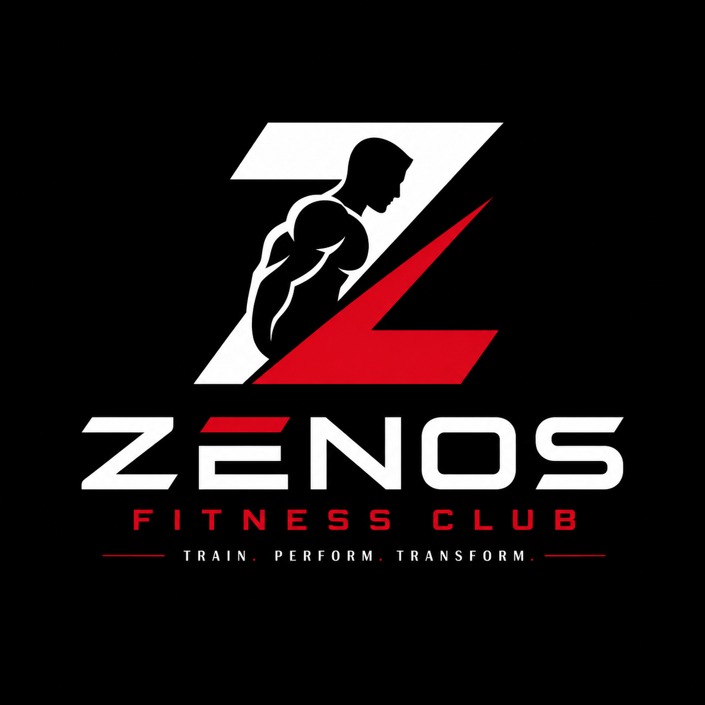
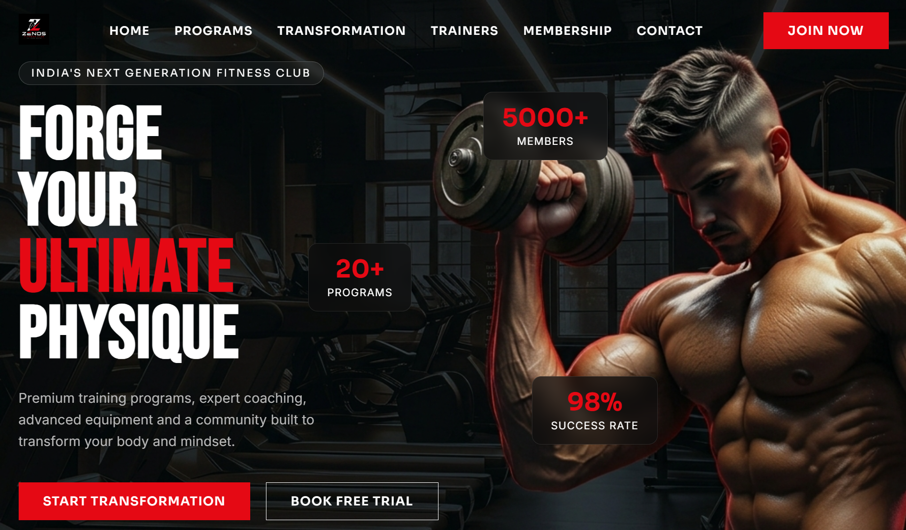
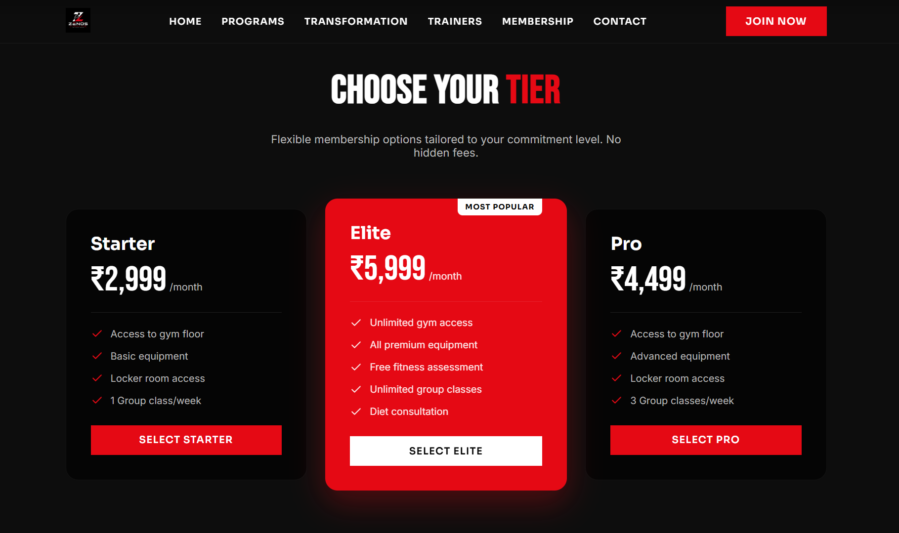

<div align="center">
  
</div>

<h1 align="center">ZENOS Fitness Club - Premium UI Website</h1>

<div align="center">
  <strong>🚀 Source Code:</strong> <a href="https://github.com/DarVoidX/FUTURE_FS_03.git">https://github.com/DarVoidX/FUTURE_FS_03.git</a>
</div>

<br />

## 📖 About This Project

This project is a highly premium, modern, and aesthetic front-end website built for **ZENOS Fitness Club**. Every single detail of this website, including the sleek branding, the "ZENOS" logo, the custom high-end imagery, and the flawless user interface, was carefully crafted and built from scratch. 

Taking time with incredible patience and leveraging advanced AI, this entire world-class gym website was successfully built and brought to life within just a single day!

## 📸 Screenshots

### Home Page


### Membership Page


## 🛠️ Built With

* **React + Vite** - Lightning-fast frontend framework
* **GSAP + Framer Motion** - Smooth, Apple-like scroll animations and transitions
* **Vanilla CSS** - Completely custom styling for absolute control over the premium dark-mode aesthetic.

## 🚀 How to Run Locally

1. Clone the repository
2. Install dependencies:
   ```bash
   npm install
   ```
3. Start the development server:
   ```bash
   npm run dev
   ```

---
*Built with patience, precision, and AI.*
